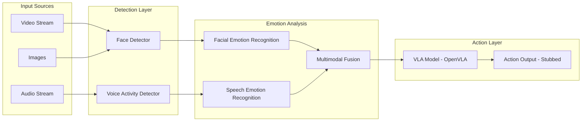

# Emotion Detector SDK for Robotics

## Architecture Overview




## Model Selection

| Component | Recommended Model | HuggingFace Path ||-----------|------------------|------------------|| VLA (configurable) | OpenVLA-7B | `openvla/openvla-7b` || Face Detection | RetinaFace / MTCNN | `timesler/facenet-pytorch` || Facial Emotion | FER2013-based models | `trpakov/vit-face-expression` || Speech Emotion | Wav2Vec2-based | `ehcalabres/wav2vec2-lg-xlsr-en-speech-emotion-recognition` |

## Proposed Folder Structure

```javascript
emotion-detector/
├── src/
│   └── emotion_detector/
│       ├── __init__.py
│       ├── core/
│       │   ├── __init__.py
│       │   ├── detector.py          # Main EmotionDetector class
│       │   ├── config.py            # Configuration management
│       │   └── types.py             # Type definitions, dataclasses
│       ├── inputs/
│       │   ├── __init__.py
│       │   ├── base.py              # Abstract input handler
│       │   ├── video.py             # Video/webcam processing
│       │   ├── image.py             # Image processing
│       │   └── audio.py             # Audio/microphone processing
│       ├── detection/
│       │   ├── __init__.py
│       │   ├── face.py              # Face detection
│       │   └── voice.py             # Voice activity detection
│       ├── emotion/
│       │   ├── __init__.py
│       │   ├── facial.py            # Facial emotion recognition
│       │   ├── speech.py            # Speech emotion recognition
│       │   └── fusion.py            # Multimodal emotion fusion
│       ├── models/
│       │   ├── __init__.py
│       │   ├── base.py              # Abstract model interface
│       │   ├── registry.py          # Model registry for configurability
│       │   └── vla/
│       │       ├── __init__.py
│       │       ├── base.py          # VLA interface
│       │       └── openvla.py       # OpenVLA implementation
│       └── actions/
│           ├── __init__.py
│           ├── base.py              # Action interface
│           └── stub.py              # Stubbed action handler
├── tests/
│   ├── __init__.py
│   ├── test_inputs/
│   ├── test_detection/
│   ├── test_emotion/
│   └── test_integration/
├── examples/
│   ├── basic_usage.py
│   ├── realtime_webcam.py
│   └── batch_processing.py
├── pyproject.toml
├── README.md
└── LICENSE
```


## Key Design Decisions

1. **Model Registry Pattern**: All models (VLA, emotion, detection) registered via a central registry, allowing runtime configuration
2. **Abstract Base Classes**: Each component has an interface, enabling custom implementations
3. **Async Support**: Real-time processing uses async/await for non-blocking I/O
4. **Dataclasses for Types**: Strong typing with `EmotionResult`, `DetectionResult`, `ActionCommand`

## SDK API Design (Target Interface)

```python
from emotion_detector import EmotionDetector, Config

# Configure with custom VLA model
config = Config(
    vla_model="openvla/openvla-7b",  # Configurable
    device="cuda",
    mode="realtime"  # or "batch"
)

detector = EmotionDetector(config)

# Real-time mode
async for result in detector.stream(video_source=0, audio_source=0):
    print(result.emotions)  # {"happy": 0.8, "neutral": 0.2}
    print(result.action)    # Stubbed action output

# Batch mode
results = detector.process(
    video_path="recording.mp4",
    audio_path="recording.wav"
)


```